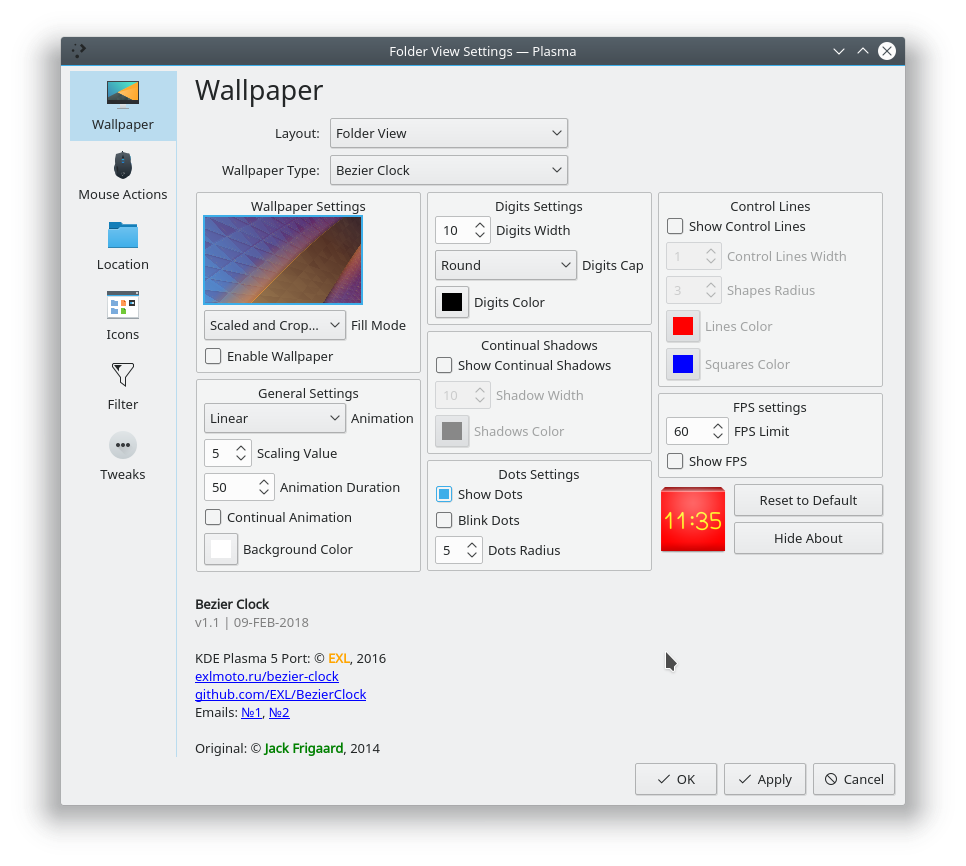
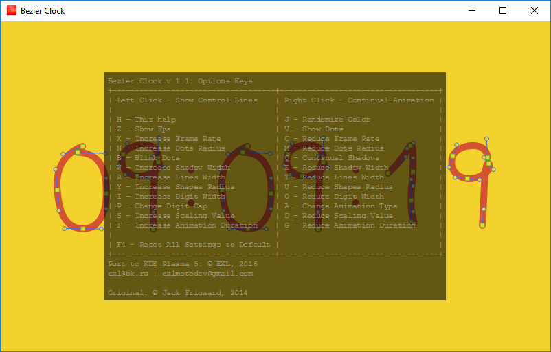

Bezier Clock
=============

Port Processing.js [Bezier Clock by Jack Frigaard](http://frigaardj.github.io/bezier-clock/) to Qt Quick/QML for KDE Plasma 5 Live Wallpaper.


Repository contains code of:

* Bezier Clock Live Wallpaper with settings window

Right click on Plasma Desktop, click on "Desktop Settings" and choose "Bezier Clock" from "Wallpaper Type":



* Simple standalone Qt Quick/QML Application:



Video demonstration:

[Bezier Clock on YouTube](http://youtu.be/S5bH2YC9VdM)

## Download

You can download TAR.XZ-packages for KDE Plasma 5 from the [releases](https://github.com/EXL/BezierClock/releases) section.

## Get the source code

* Clone repository into deploy directory:

```sh
cd ~/Deploy/
git clone https://github.com/EXL/BezierClock
```

## Build and Install Plasma package

* Build the Plasma package into deploy directory:

```sh
cd ~/Deploy/BezierClock/utils/
./package.sh -p
```

* Install Plasma package in your KDE Plasma 5 Workspace with Plasma Package Manager:

```sh
cd ~/Deploy/BezierClock/utils/
plasmapkg2 -t wallpaperplugin -i bezier-clock-v1.0.tar.xz
```

## Build and Install TAR.XZ-package

* Build the TAR.XZ-package into deploy directory:

```sh
cd ~/Deploy/BezierClock/utils/
./package.sh -p
```

* Install TAR.XZ-package in your KDE Plasma 5 Workspace (~/.local/share/plasma/wallpapers):

```sh
cd ~/Deploy/BezierClock/utils/
./package.sh -i
```

## Build and Install Arch Linux package

* Build the Arch Linux package into deploy directory:

```sh
cd ~/Deploy/BezierClock/utils/
makepkg -cf
```

* Install Arch Linux package in your system with "pacman" or "yaourt":

```sh
cd ~/Deploy/BezierClock/utils/
sudo pacman -U bezier-clock-v1.0-1-any.pkg.tar.xz
```

## Build standalone Qt Quick/QML-application

* Build and Run Bezier Clock executable into deploy directory:

```sh
cd ~/Deploy/BezierClock/
qmake BezierClock.pro
make -j9
./BezierClock
```

## Removing package

* If you installed Plasma package in your KDE Plasma 5 Workspace:

```sh
plasmapkg2 -t wallpaperplugin -r ru.exlmoto.bezierclock
```

* If you installed TAR.XZ-package in your home directory:

```sh
cd ~/Deploy/BezierClock/utils/
./package.sh -u
```

* If you installed Arch Linux package with pacman or yaourt:

```sh
sudo pacman -R bezier-clock
```

## Tips and Tricks

**Warning!**
In some versions of the KDE Plasma 5 Workspace (5.7.x for example) after the installation and activating Bezier Clock you can see a black screen.
It is due to these bugs here: [bug #1](https://bugs.kde.org/show_bug.cgi?id=367546) and [bug #2](https://bugs.kde.org/show_bug.cgi?id=366390).
Reset to default settings using the "Reset To Default" button and click "Apply" for fix it.

To reduce the load on the CPU cores, lower the value of the option "FPS Limit" to acceptable values.
To ensure a smooth animation at low FPS, you can adjust the option "Animation Duration", with lowering its value.
For example, a 25 value of "FPS Limit" and 30 of "Animation Duration" gives a good result.

Run Bezier Clock, experiment with the options and enjoy!

## More information

Please read [Porting Guide (In Russian)](http://exlmoto.ru/bezier-clock) for more info about porting Bezier Clock to KDE Plasma 5 Live Wallpaper.
